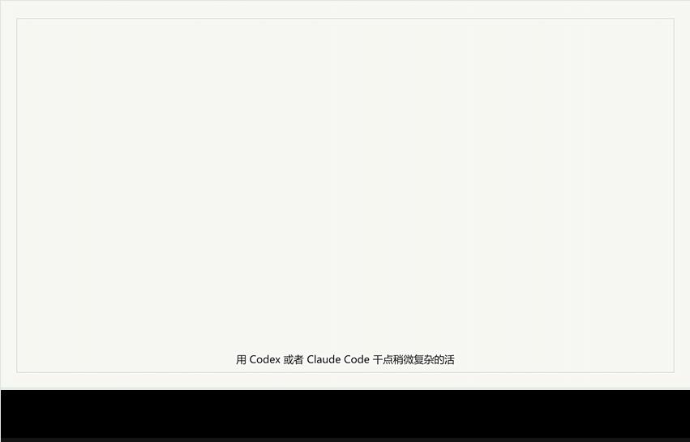
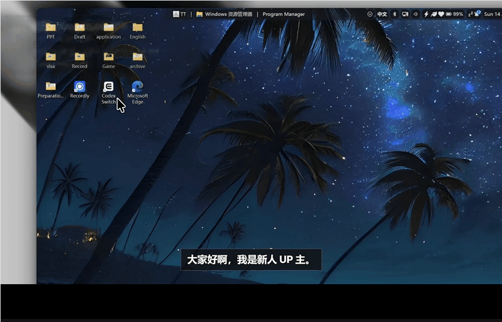

<p align="center">
  
</p>

<h1 align="center">Video Flow</h1>

<p align="center">
  <a href="README.md">English</a> · 简体中文
</p>

<p align="center">
  用 HTML、真实录屏或设计场景、TTS、字幕和 Hyperframes 制作短视频。
</p>

## 演示

<table>
  <tr>
    <th align="center">Prompt Flow</th>
    <th align="center">Codex Switch</th>
  </tr>
  <tr>
    <td></td>
    <td></td>
  </tr>
</table>

## 它是什么

Video Flow 是一个用代码制作产品演示视频的小工作流。

主画面用 HTML/CSS/GSAP 编写，再由 Hyperframes 渲染成 MP4。视频可以使用真实产品录屏，也可以直接做设计场景，或者两者混合。旁白可以用 TTS，字幕最好基于真实音频时间轴再人工修正。

## 关系

```text
video-flow
  -> 可复用的视频工作流

examples/prompt-flow
  -> prompt-flow 演示视频源码

examples/codex-switch
  -> 另一个完整示例

skills/
  -> Hyperframes 和 Mambo TTS 的 agent 指南
```

`examples/*.gif` 是预览演示。完整录屏、生成音频和最终 MP4 属于本地或 Release 资产。

## 工作方式

```text
规划故事
  -> 编写 HTML/CSS 场景
  -> 加入真实录屏或设计 UI
  -> 生成或复用旁白
  -> 用 Hyperframes 渲染
  -> 检查关键帧和字幕
```

## 运行要求

- Node.js 和 npm。
- FFmpeg 和 ffprobe。
- Hyperframes：通过 npm scripts 里的 `npx` 调用。

可选 skill：

```powershell
npx skills add https://github.com/heygen-com/hyperframes --skill hyperframes
openclaw skills install @systiger/mambo-tts
```

如果你的 Mambo 设置使用自定义 Edge TTS converter 路径：

```powershell
$env:MAMBO_TTS_CONVERTER = "<path-to-tts-converter.js>"
```

## 运行

安装依赖：

```powershell
npm install
```

构建 prompt-flow：

```powershell
npm run prompt-flow:build
npm run render
```

如果要重建完整 prompt-flow 视频，把录屏放到：

```text
examples/prompt-flow/assets/codex-flow.mp4
examples/prompt-flow/assets/claude-flow.mp4
```

构建 codex-switch：

```powershell
npm run example:build
npm run render
```

预览：

```powershell
npm run dev
```

## Examples

`examples/prompt-flow/`

- `tools/build-prompt-flow-v10-mambo.mjs` 构建当前 prompt-flow composition。
- `ART_DIRECTION.md` 记录视觉方向。
- `assets/*.srt` 和旁白文本是审阅文件。

`examples/codex-switch/`

- 第二个示例，用来参考原始的可复用模式。

## 工具

| 工具 | 作用 |
| --- | --- |
| Hyperframes | 把 HTML 视频 composition 渲染成 MP4。 |
| GSAP | 驱动场景和解释层动画。 |
| Mambo TTS | 为 prompt-flow 演示生成中文旁白。 |
| FFmpeg / ffprobe | 检查媒体、导出关键帧、烧录字幕。 |
| Whisper | 生成基于音频的字幕时间轴。 |
| Codex / Claude Code | 辅助修改 composition、脚本和文档。 |

## 协议

MIT License。见 [LICENSE](LICENSE)。
